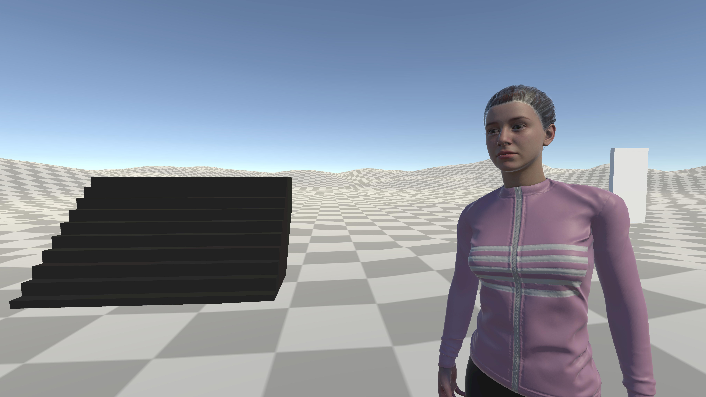
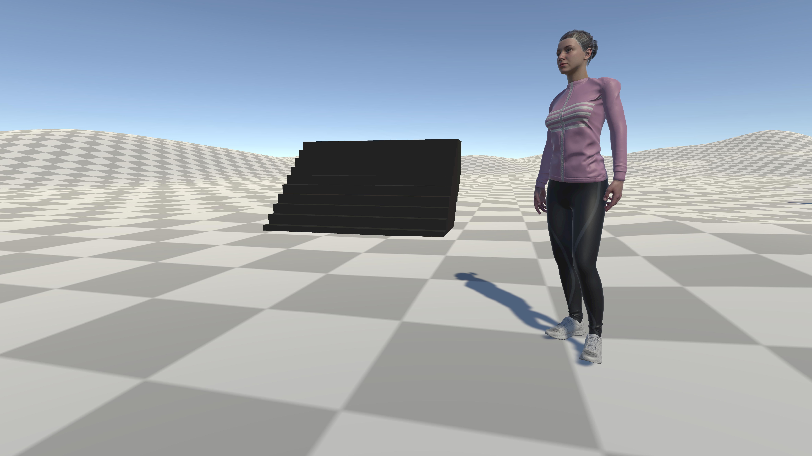

# Unity 3D Character Controller System
Overview
This project is a Unity 3D character controller system designed to deliver smooth and immersive gameplay. It integrates realistic animations, dynamic sound effects, and responsive camera controls. The system supports both keyboard and gamepad inputs, ensuring versatile control for players.
---
## 🚀 Features
- 🖼 **Smooth Animations**: Seamless character movements for a fluid and lifelike experience.
- 🎯 **Dynamic Sound Effects**: Real-time audio integration to enhance immersion.
- 💼 **Optimized Virtual Camera Controls**: Precise and responsive camera movement for optimal player perspectives.
- 🎨 **Multi-Input Support**: Compatible with both keyboard and gamepad inputs for versatile control options.
- 📱 **User-Friendly Gameplay**: Designed for engaging and intuitive player interaction.
## 🚀 Focus Areas
- 🎲 **Polished Gameplay**: Smooth interactions between animations, sound effects, and controls for a seamless experience.
- 🙅‍♂️ **Immersion**: Dynamic elements added to enhance the depth and realism of the gameplay.
- 💼 **Scalability**: A flexible foundation built for future expansions or additional game mechanics.

## 📸 Screenshots

|  |
|:---:|

|  |
|:---:|

  
## Getting Started
To use this system, simply clone or download the repository and integrate it into your Unity project. Follow the setup instructions to configure input settings for both keyboard and gamepad control.

## Third Party Tools
@Mixamo_Characters_&_Animations 

## Future Improvements
Adding new character animation types
Further enhancing dynamic sound and camera systems
## 👤 Author

- **Name**: Athar Ibrahim Khalid
- **GitHub**: [https://github.com/AtharIbrahim/](https://github.com/AtharIbrahim/)
- **LinkedIn**: [https://www.linkedin.com/in/athar-ibrahim-khalid-0715172a2/](https://www.linkedin.com/in/athar-ibrahim-khalid-0715172a2/)
- **Website**: [Athar Ibrahim Khalid](https://atharibrahimkhalid.netlify.app/)

## 📝 License

This project is licensed under the MIT License. See the [LICENSE](LICENSE) file for details.
